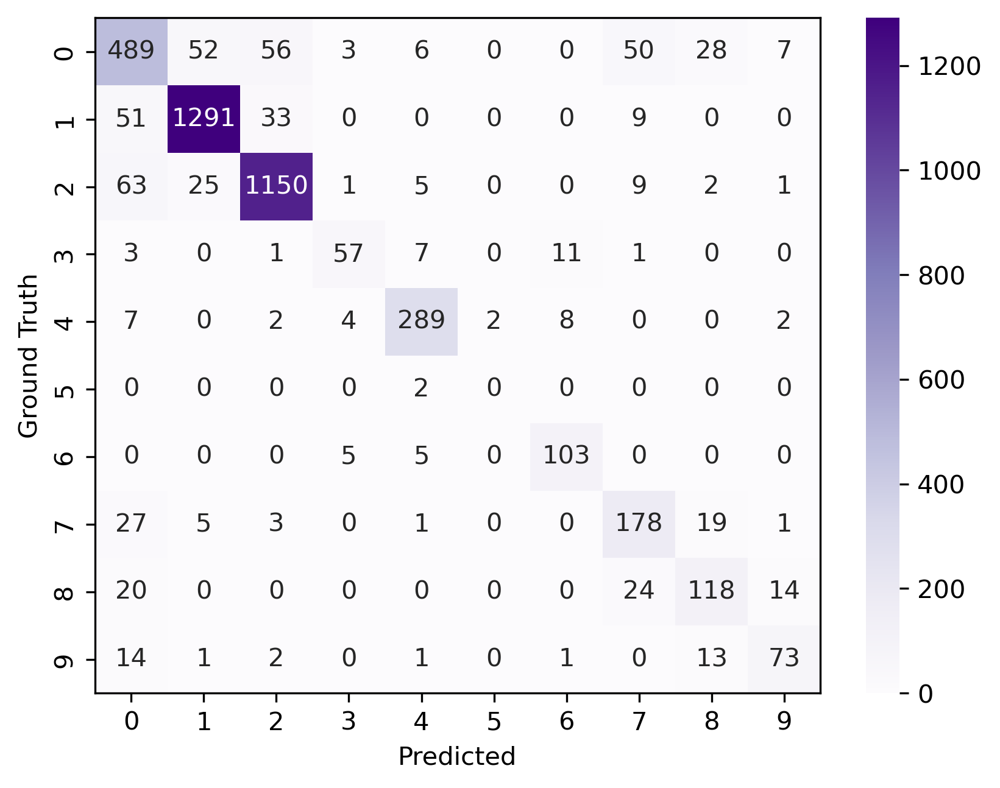
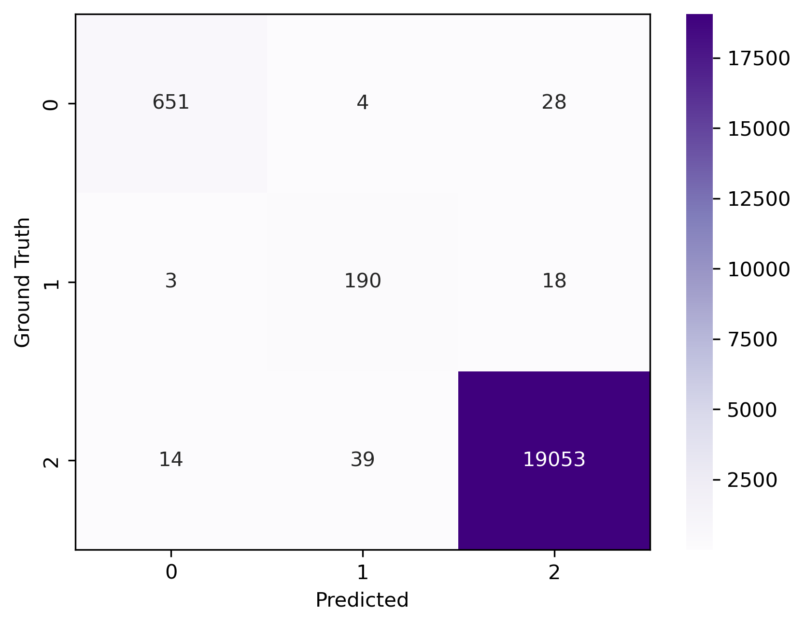

<div align="center">

# ResClass
### 使用ResNet的星系与光谱分类

[](https://www.python.org/)
[](https://pytorch.org/)
[](https://opensource.org/licenses/MIT)

</div>

<p align="center">
  <a href="#-数据集">数据集</a> •
  <a href="#-环境配置">环境配置</a> •
  <a href="#-星系分类">星系分类</a> •
  <a href="#-光谱分类">光谱分类</a> •
  <a href="#-测试结果">测试结果</a>
</p>

## 📊 数据集

项目需要以下数据文件，请将它们放入 `Data/` 目录：

- 星系图像数据: [Galaxy10.h5](http://www.astro.utoronto.ca/~bovy/Galaxy10/Galaxy10.h5)
- 光谱训练数据: [train_data_10.fits](https://nadc.china-vo.org/res/file_upload/download?id=46376)
- 光谱测试数据: `test_data.fits`

## 🛠 环境配置

```bash
# 安装所有依赖
pip install -r requirements.txt
```

主要依赖为 PyTorch 相关库。也可以直接运行训练脚本，系统会提示安装缺失的依赖。

## 星系分类

### 模型架构
- 基于 **ResNet50** 架构

### 训练流程
1. 数据全部载入内存（除了前10张预留测试图像）
2. 以8:2比例划分训练集和验证集
3. 批量大小为64，按类别比重加权采样
4. 数据增强：随机旋转、翻转、亮度和对比度变化
5. 训练50个epoch

```bash
python galaxy_train.py
```

### 训练结果
- **验证集最低损失时**：
  - 训练集准确率: 95.37%
  - 验证集准确率: 86.62%

- **验证集最高准确率**：
  - 训练集准确率: 95.49%
  - 验证集准确率: 86.98%

<div align="center">
  
  <p><i>验证集混淆矩阵</i></p>
</div>

## 光谱分类

### 模型架构
- 基于 **Conv1D** 构建的 **ResNet18**

### 训练流程
1. 数据全部载入内存（10号fits文件）
2. 以8:2比例划分训练集和验证集
3. 批量大小为64，按类别比重加权采样
4. 数据增强：随机噪声和归一化
5. 训练50个epoch

```bash
python spec_train.py
```

### 训练结果
- **验证集最低损失时**：
  - 训练集准确率: 99.96%
  - 验证集准确率: 99.51%

- **验证集最高准确率**：
  - 训练集准确率: 99.99%
  - 验证集准确率: 99.52%

<div align="center">
  
  <p><i>验证集混淆矩阵</i></p>
</div>

> **注意**: 实验表明ResNet18已足够应对此任务，一个epoch基本可以达到很好的效果，特别是在较小batch_size的情况下。

## 🧪 测试结果

测试结果在 `Galaxy_Spec_Predict.ipynb` 中详细展示：
- 星系分类：使用10张预留测试图像
- 光谱分类：对 `test_data.fits` 进行预测，结果保存在 `Spec_Test.csv`

